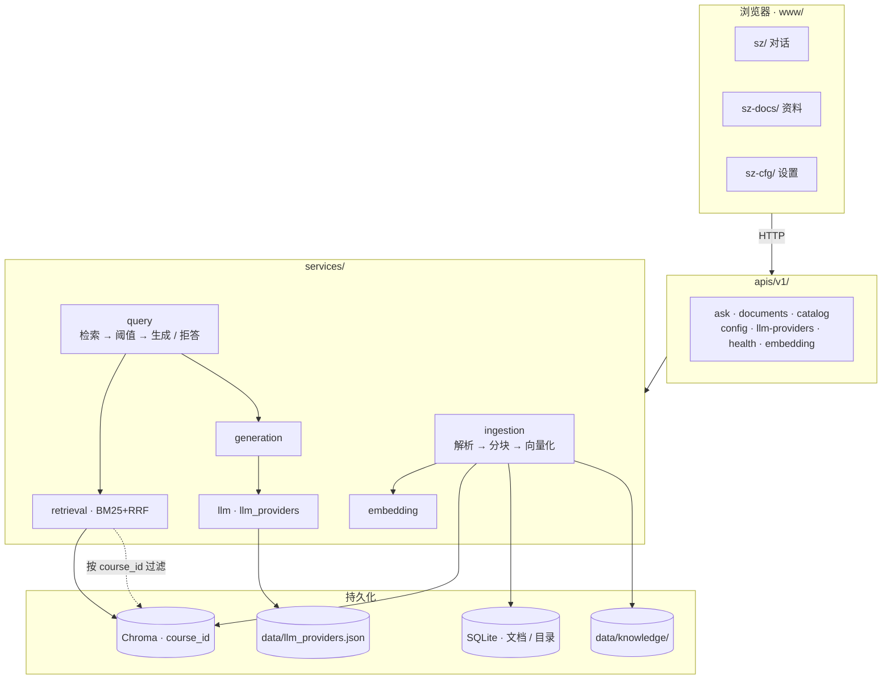
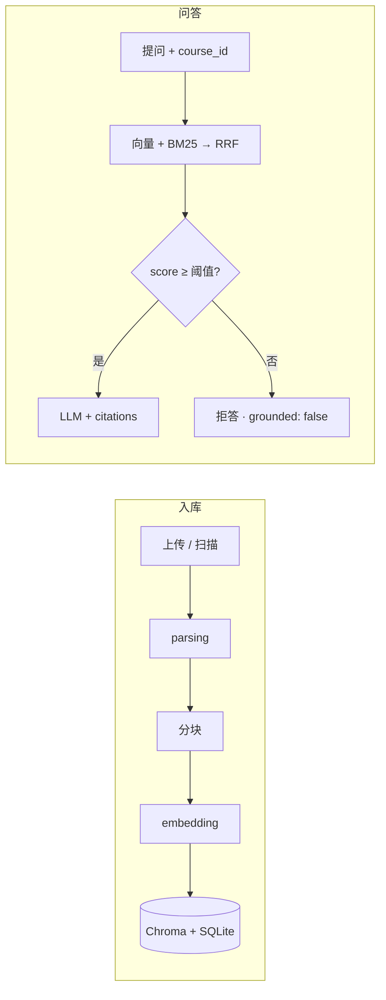

<div align="center">

# 溯知

### exam-rag · 据源而答 · 出处可循

把讲义、笔记、真题放进本机资料库，用自然语言提问。  
答案必须落到具体片段；检索不够就拒答，不硬编。

[](https://www.python.org/)
[](https://fastapi.tiangolo.com/)
[](https://www.trychroma.com/)
[](https://docs.astral.sh/uv/)

</div>

## 它做什么

本地跑起来的课程资料问答：入库 → 按课隔离检索 → 带引用作答。前端在 `www/`（手写 HTML/CSS/JS，无构建），后端是 FastAPI + Chroma + SQLite。

| 能力 | 说明 |
|:-----|:-----|
| 自由问答 | `mode=qa`，混合检索（向量 + BM25 → RRF） |
| 知识点 | `mode=concept`，更大 top_k，按「定义 → 公式 → 例题」聚合 |
| 拒答 | 最高分低于阈值 → `grounded: false`，固定文案，禁止无引用硬编 |
| 多课隔离 | 一切检索 / 上传 / 删除都带 `course_id` |
| 资料格式 | PDF · TXT · MD · DOC · DOCX · PPTX（扫描 PDF 可选 OCR） |

## Quick Start

需要 Python ≥ 3.11、[uv](https://docs.astral.sh/uv/)，以及 OpenAI 兼容的对话 API（`LLM_API_KEY`）。扫描版 PDF 可选 [Tesseract](https://github.com/tesseract-ocr/tesseract)（`eng` / `chi_sim`）。旧版 `.doc` 建议装 [LibreOffice](https://www.libreoffice.org/)。

```bash
cp .env.example .env   # 填写 LLM_API_KEY，或启动后在设置页注册模型
uv sync
uv run exam            # → http://127.0.0.1:8787
```

| 地址 | 用途 |
|:-----|:-----|
| [`/sz/`](http://127.0.0.1:8787/sz/) | 对话（自由问答 / 知识点） |
| [`/sz-docs/`](http://127.0.0.1:8787/sz-docs/) | 资料上传 / 扫描 |
| [`/sz-cfg/`](http://127.0.0.1:8787/sz-cfg/) | 设置（LLM、检索阈值、OCR…） |
| [`/docs`](http://127.0.0.1:8787/docs) | OpenAPI |
| [`/api/v1/health`](http://127.0.0.1:8787/api/v1/health) | 健康检查 |

启动时会校验配置，并扫描 `data/knowledge/` 里尚未入库的文件（默认课）。

## Commands

| 命令 | 说明 |
|:-----|:-----|
| `uv sync` | 安装依赖 |
| `uv run exam` | 启动服务（默认 `8787`） |
| `DEBUG=true uv run exam` | 调试模式 |
| `uv run pytest -q` | 单元测试 |
| `uv run pytest -q -m integration` | 集成测试（需 Embedding 与 LLM） |
| `uv add <package>` | 添加依赖 |

```bash
curl http://127.0.0.1:8787/api/v1/health
```

## Architecture

浏览器只调 `/api/v1/*`；RAG 在 `services/`，不进 UI。





| 模块 | 职责 |
|:-----|:-----|
| `ingestion` / `parsing` | 解析分块入库；PDF 可 OCR |
| `retrieval` | 向量 + BM25 → RRF，按课过滤 |
| `query` / `generation` | `qa` / `concept` 编排与 prompt |
| `embedding` / `llm` | 本地或 OpenAI 兼容 API |
| `storage/` | Chroma 向量 · SQLite 元数据与目录 |

细节见 [docs/02-模块架构.md](docs/02-模块架构.md)。

<details>
<summary>目录结构</summary>

```
exam-rag/
├── data/                    # 运行时（gitignore）：knowledge、llm_providers.json
├── storage/                 # 运行时（gitignore）：Chroma · meta.db · 日志
├── src/
│   ├── main.py              # FastAPI · 挂载 www/
│   ├── apis/v1/
│   └── services/
├── www/                     # 前端源码（入库）
│   ├── shared/
│   ├── sz/
│   ├── sz-docs/
│   └── sz-cfg/
├── docs/
└── tests/
```

</details>

## Configuration

优先级：**环境变量 > `.env` > 代码默认值**。复制 `.env.example`，或在 `/sz-cfg/` 改。

| 分组 | 关键变量 |
|:-----|:---------|
| LLM | `LLM_PROVIDER` · `LLM_API_KEY` · `LLM_BASE_URL` · `LLM_MODEL` |
| Embedding | `EMBEDDING_PROVIDER`（`local` / `openai`）· `EMBEDDING_MODEL` |
| 存储 | `CHROMA_PATH` · `SQLITE_PATH` · `KNOWLEDGE_DIR` · `MAX_UPLOAD_MB` |
| PDF | `PDF_USE_OCR` · `PDF_FORCE_OCR` · `PDF_OCR_LANGUAGE` |
| 代理 | `PROXY_URL` · `PROXY_ENABLED` · `NO_PROXY` |

可注册多个 LLM（OpenAI 兼容 / Ollama），「设为当前」后会写回 `.env`。

<details>
<summary>检索与分块</summary>

| 参数 | 默认 | 含义 |
|:-----|:-----|:-----|
| `top_k` | 5 | RRF 融合后保留条数；`concept` 默认更大 |
| `score_threshold` | 0.25 | 低于此分拒答 |
| `chunk_size` | 800 | 分块字符数 |
| `chunk_overlap` | 50 | 相邻块重叠 |

</details>

## API

统一：`{ "code": 200, "data": … }` 或 `{ "code": 4xx, "message": "…" }`。完整契约见 [`/docs`](http://127.0.0.1:8787/docs)。

| 方法 | 路径 | 说明 |
|:----:|:-----|:-----|
| `GET` | `/api/v1/health` | 连通性 |
| `GET` / `PATCH` | `/api/v1/config` | 配置 |
| `GET` / `POST` | `/api/v1/llm-providers` | 列出 / 注册模型 |
| `POST` | `/api/v1/llm-providers/active` | 切换当前模型 |
| `DELETE` | `/api/v1/llm-providers/{name}` | 删除注册项 |
| `POST` | `/api/v1/embedding/warmup` | 预热 Embedding |
| `GET` | `/api/v1/colleges` | 学院 |
| `GET` | `/api/v1/courses` | 课程（可选 `?college_id=`） |
| `POST` | `/api/v1/documents` | 上传（Form 必填 `course_id`） |
| `GET` | `/api/v1/documents` | 列表（`?course_id=`） |
| `POST` | `/api/v1/documents/scan` | 扫描 knowledge 目录 |
| `DELETE` | `/api/v1/documents/{doc_id}` | 删除（`?course_id=`） |
| `POST` | `/api/v1/ask` | 问答（`course_id`；`mode=qa\|concept`） |

默认课：`course-default`。同一物理文件不会跨课改归属。

<details>
<summary>问答示例</summary>

```json
POST /api/v1/ask
{
  "question": "卷积定理是什么？",
  "course_id": "course-default",
  "mode": "qa",
  "stream": false
}
```

知识点（定义 → 公式 → 例题）：

```json
POST /api/v1/ask
{
  "question": "卷积定理",
  "course_id": "course-default",
  "mode": "concept",
  "stream": true
}
```

```json
{
  "code": 200,
  "data": {
    "answer": "...",
    "grounded": true,
    "citations": [
      { "source_file": "chapter3.pdf", "page": 42, "snippet": "...", "score": 0.68 }
    ]
  }
}
```

`stream: true` → SSE：`phase` → `delta` → `done`（拒答则直接 `done`）。

</details>

## Status

| 阶段 | 状态 |
|:-----|:-----|
| P0 入库 / 问答 / 拒答 / WebUI | 已实现 |
| P1-A 学院·课程隔离 | 已实现 |
| P1-B `mode=concept` · 混合检索 · PPT | 已实现 |
| P2 章节概览 · Reranker · 离线评估 | 未做 |

## Development

| 约定 | 说明 |
|:-----|:-----|
| `apis/` | 只做 HTTP |
| `services/` | 不 import FastAPI |
| `www/` | 前端源码，随仓库提交 |
| 新依赖 | `uv add <package>` |

WSL：venv 放 `~/`，别放 `/mnt/`，否则模型加载容易超时。

## Documentation

| 文档 | 内容 |
|:-----|:-----|
| [01 产品边界](docs/01-产品边界.md) | 场景与范围 |
| [02 模块架构](docs/02-模块架构.md) | 流水线与数据模型 |
| [03 工程规范](docs/03-工程规范.md) | 工具链与约定 |
| [04 后续演进](docs/04-后续演进规范.md) | 多课程、检索增强、Agent |
| [05 Web UI](docs/05-WebUI规划.md) | 工作台规格 |
