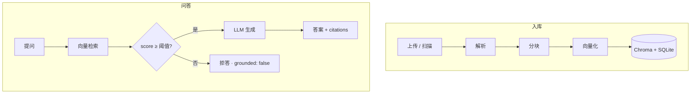

<div align="center">

<h1>溯知</h1>
<p><code>exam-rag</code></p>
<p><strong>据源而答 · 出处可循</strong></p>

[](https://www.python.org/)
[](https://fastapi.tiangolo.com/)
[](https://www.trychroma.com/)
[](https://docs.astral.sh/uv/)

上传资料 · 语义检索 · 带引用作答 · 依据不足则拒答

[快速开始](#快速开始) · [架构](#架构) · [配置](#配置) · [API](#api) · [开发](#开发) · [文档](docs/)

</div>

---

## 这是什么

把讲义、笔记、真题放进资料库，用自然语言提问。回答必须能落到具体片段上；检索分数不够就明确拒答，不硬编。

面向备考与复盘：资料在你这边，按课程隔离（见 `docs/04`）。

---

## 快速开始

> 需要 Python ≥ 3.11、[uv](https://docs.astral.sh/uv/)，以及 OpenAI 兼容 API（`LLM_API_KEY`）。扫描版 PDF 可选 [Tesseract](https://github.com/tesseract-ocr/tesseract)（`eng` / `chi_sim`）。

```bash
cp .env.example .env          # 填写 LLM_API_KEY（或之后在设置页注册模型）
uv sync
uv run exam                   # → http://127.0.0.1:8787
```

| 地址 | 用途 |
|:-----|:-----|
| [`/sz/`](http://127.0.0.1:8787/sz/) | 对话 |
| [`/sz-docs/`](http://127.0.0.1:8787/sz-docs/) | 资料上传 / 扫描 |
| [`/sz-cfg/`](http://127.0.0.1:8787/sz-cfg/) | 设置（含 LLM 注册与切换） |
| [`/docs`](http://127.0.0.1:8787/docs) | OpenAPI |
| [`/api/v1/health`](http://127.0.0.1:8787/api/v1/health) | 健康检查 |

前端为手写 HTML/CSS/JS（无构建），挂载在 `www/`。启动时校验配置并扫描 `data/knowledge/` 中尚未入库的文件（默认课）。

```bash
curl http://127.0.0.1:8787/api/v1/health
uv run pytest -q
```

---

## 架构



检索最高分低于 `score_threshold` 时返回 `grounded: false`，文案固定为「资料库中未找到相关内容」。

| 模块 | 职责 |
|:-----|:-----|
| `services/ingestion.py` | 解析 → 分块 → 向量化 → 写入 |
| `services/parsing.py` | PDF / DOCX / PPTX / TXT / MD（PDF 可选 OCR） |
| `services/retrieval.py` | 向量相似度 top_k（按 `course_id`） |
| `services/generation.py` | 拼 prompt、调 LLM、组装引用 |
| `services/query.py` | 串联检索与生成，拒答判断 |
| `services/embedding.py` | sentence-transformers 或 OpenAI 兼容 API |
| `services/llm.py` | OpenAI 兼容对话 API |
| `services/llm_providers.py` | 模型注册表（`data/llm_providers.json`） |

<details>
<summary><strong>目录结构</strong></summary>

```
exam-rag/
├── data/knowledge/       # 原始资料
├── data/llm_providers.json  # LLM 注册表（运行时生成）
├── storage/              # Chroma · SQLite · 日志
├── src/
│   ├── main.py
│   ├── apis/v1/          # health · config · llm-providers · catalog · documents · ask · embedding
│   └── services/
├── www/
│   ├── shared/           # tokens · shell · api · KaTeX
│   ├── sz/               # 对话
│   ├── sz-docs/          # 资料
│   └── sz-cfg/           # 设置
└── tests/
```

</details>

---

## 配置

优先级：**环境变量 > `.env` > 代码默认值**。复制 `.env.example` 后按需修改；也可在 `/sz-cfg/` 写入。

| 分组 | 关键变量 |
|:-----|:---------|
| LLM | `LLM_PROVIDER`（注册表名）· `LLM_API_KEY` · `LLM_BASE_URL` · `LLM_MODEL` |
| Embedding | `EMBEDDING_PROVIDER`（`local` / `openai`）· `EMBEDDING_MODEL` |
| 存储 | `CHROMA_PATH` · `SQLITE_PATH` · `KNOWLEDGE_DIR` · `MAX_UPLOAD_MB` |
| PDF | `PDF_USE_OCR` · `PDF_FORCE_OCR` · `PDF_OCR_LANGUAGE` |
| 代理 | `PROXY_URL` · `PROXY_ENABLED` · `NO_PROXY` |

推荐在设置页 **注册多个 LLM**（OpenAI 兼容 / 本地 Ollama），再「设为当前」；活跃项会同步回 `.env`。

<details>
<summary><strong>检索与分块</strong>（<code>config.py</code>）</summary>

| 参数 | 默认 |
|:-----|:-----|
| `top_k` | 5 |
| `score_threshold` | 0.25 |
| `chunk_size` | 800 |
| `chunk_overlap` | 50 |

</details>

---

## API

统一响应：`{ "code": 200, "data": … }` 或 `{ "code": 4xx, "message": "…" }`。

| 方法 | 路径 | 说明 |
|:----:|:-----|:-----|
| `GET` | `/api/v1/health` | 连通性 |
| `GET` / `PATCH` | `/api/v1/config` | 读写配置 |
| `GET` / `POST` | `/api/v1/llm-providers` | 列出 / 注册模型 |
| `POST` | `/api/v1/llm-providers/active` | 切换当前模型 |
| `DELETE` | `/api/v1/llm-providers/{name}` | 删除注册项 |
| `POST` | `/api/v1/embedding/warmup` | 预热本地 Embedding |
| `GET` | `/api/v1/colleges` | 学院列表 |
| `GET` | `/api/v1/courses` | 课程列表（可选 `?college_id=`） |
| `POST` | `/api/v1/documents` | 上传并入库（Form **必填** `course_id`） |
| `GET` | `/api/v1/documents` | 资料列表（**必填** `?course_id=`） |
| `POST` | `/api/v1/documents/scan` | 扫描 `data/knowledge/`（Form **必填** `course_id`） |
| `DELETE` | `/api/v1/documents/{doc_id}` | 删除（**必填** `?course_id=`，须匹配归属） |
| `POST` | `/api/v1/ask` | 问答（JSON **必填** `course_id`） |

检索与资料按 `course_id` 隔离。默认种子为 `course-default`。同一物理文件不会跨课串改归属。

<details>
<summary><strong>问答示例</strong></summary>

```json
POST /api/v1/ask
{
  "question": "卷积定理是什么？",
  "course_id": "course-default",
  "mode": "qa",
  "stream": false
}
```

```json
{
  "code": 200,
  "data": {
    "answer": "...",
    "grounded": true,
    "citations": [
      { "source_file": "chapter3.pdf", "page": 42, "snippet": "...", "score": 0.68 }
    ]
  }
}
```

`stream: true` 时为 SSE：`phase` → `delta` → `done`（拒答则直接 `done`）。

</details>

支持：`.pdf` · `.txt` · `.md` · `.doc` · `.docx` · `.pptx`

---

## 现状与路线

| 阶段 | 状态 |
|:-----|:-----|
| P0 入库 / 问答 / 拒答 / WebUI | 已实现 |
| P1-A 学院·课程目录与隔离 | 已实现 |
| P1-B `mode=concept` · 混合检索 | 未做（见 `docs/01`） |
| P2 章节概览 · Reranker · 离线评估 | 未做 |

---

## 开发

```bash
uv run exam
DEBUG=true uv run exam
uv run pytest -q
uv run pytest -q -m integration
```

| 约定 | 说明 |
|:-----|:-----|
| `apis/` | 只做 HTTP |
| `services/` | 不 import FastAPI |
| 新依赖 | `uv add <package>` |

WSL：venv 请放在 `~/` 下，勿放 `/mnt/` 挂载盘，否则模型加载容易超时。

---

## 文档

| 文档 | 内容 |
|:-----|:-----|
| [01 产品边界](docs/01-产品边界.md) | 场景与范围 |
| [02 模块架构](docs/02-模块架构.md) | 流水线与数据模型 |
| [03 工程规范](docs/03-工程规范.md) | 工具链与约定 |
| [04 后续演进](docs/04-后续演进规范.md) | 多课程隔离、检索增强、Agent |
| [05 Web UI](docs/05-WebUI规划.md) | 工作台规格 |

---

<div align="center">

<sub>

**溯知** · exam-rag · 据源而答 · 资料不上云

</sub>

</div>
