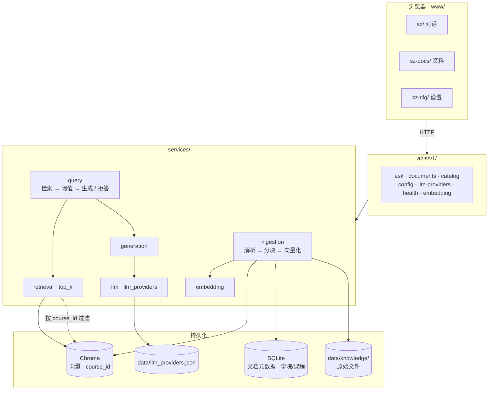
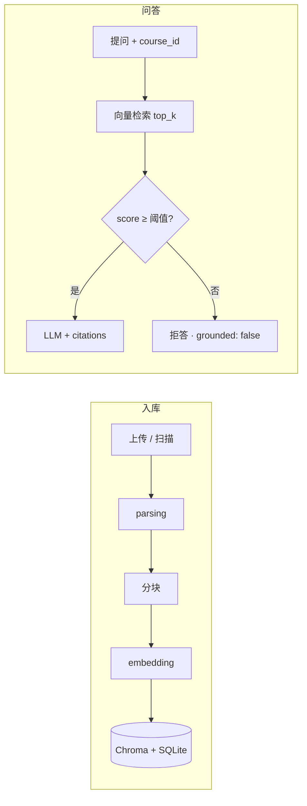

# 溯知（exam-rag）

据源而答 · 出处可循。把讲义、笔记、真题放进本地资料库，用自然语言提问；答案必须落到具体片段，检索分数不够则拒答，不硬编。资料留在本机，按 `course_id` 隔离。

[](https://www.python.org/)
[](https://fastapi.tiangolo.com/)
[](https://www.trychroma.com/)
[](https://docs.astral.sh/uv/)

## Quick Start

需要 Python ≥ 3.11、[uv](https://docs.astral.sh/uv/)，以及 OpenAI 兼容的对话 API（`LLM_API_KEY`）。扫描版 PDF 可选 [Tesseract](https://github.com/tesseract-ocr/tesseract)（`eng` / `chi_sim`）。

```bash
cp .env.example .env   # 填写 LLM_API_KEY，或启动后在设置页注册模型
uv sync
uv run exam            # → http://127.0.0.1:8787
```

| 地址 | 用途 |
|:-----|:-----|
| [`/sz/`](http://127.0.0.1:8787/sz/) | 对话 |
| [`/sz-docs/`](http://127.0.0.1:8787/sz-docs/) | 资料上传 / 扫描 |
| [`/sz-cfg/`](http://127.0.0.1:8787/sz-cfg/) | 设置（LLM 注册与切换） |
| [`/docs`](http://127.0.0.1:8787/docs) | OpenAPI |
| [`/api/v1/health`](http://127.0.0.1:8787/api/v1/health) | 健康检查 |

前端为手写 HTML/CSS/JS（无构建），位于 `www/`。启动时校验配置，并扫描 `data/knowledge/` 中尚未入库的文件（默认课）。

## Commands

| 命令 | 说明 |
|:-----|:-----|
| `uv sync` | 安装依赖 |
| `uv run exam` | 启动服务（默认 `8787`） |
| `DEBUG=true uv run exam` | 调试模式启动 |
| `uv run pytest -q` | 单元测试 |
| `uv run pytest -q -m integration` | 集成测试（需 Embedding 与 LLM） |
| `uv add <package>` | 添加依赖 |

```bash
curl http://127.0.0.1:8787/api/v1/health
```

## Architecture

请求从浏览器进 FastAPI，业务在 `services/`，持久化在 Chroma + SQLite。UI 只调 `/api/v1/*`，不写 RAG 逻辑。



两条主路径：



最高分低于 `score_threshold` 时返回 `grounded: false`，文案固定为「资料库中未找到相关内容」。

| 模块 | 职责 |
|:-----|:-----|
| `services/ingestion.py` | 解析 → 分块 → 向量化 → 写入 |
| `services/parsing.py` | PDF / DOCX / PPTX / TXT / MD（PDF 可选 OCR） |
| `services/retrieval.py` | 按 `course_id` 向量检索，`top_k` 后阈值过滤 |
| `services/generation.py` | 拼 prompt、调 LLM、组装引用 |
| `services/query.py` | 串联检索与生成，拒答判断 |
| `services/embedding.py` | 本地 sentence-transformers 或 OpenAI 兼容 API |
| `services/llm.py` | OpenAI 兼容对话 API |
| `services/llm_providers.py` | 模型注册表（`data/llm_providers.json`） |
| `services/storage/` | Chroma 向量 · SQLite 文档与目录 |

分层职责、数据模型与扩展预留见 [docs/02-模块架构.md](docs/02-模块架构.md)。

<details>
<summary>目录结构</summary>

```
exam-rag/
├── data/
│   ├── knowledge/           # 原始资料
│   └── llm_providers.json   # LLM 注册表（运行时）
├── storage/                 # Chroma · meta.db · 日志
├── src/
│   ├── main.py              # FastAPI 入口 · 挂载 www/
│   ├── config.py
│   ├── apis/v1/             # health · config · llm-providers
│   │                        # catalog · documents · ask · embedding
│   └── services/
│       ├── ingestion.py · query.py · retrieval.py · generation.py
│       ├── embedding.py · llm.py · llm_providers.py
│       └── storage/         # vector_store · doc_store · catalog_store
├── www/
│   ├── shared/              # shell · api · conversations · KaTeX
│   ├── sz/                  # 对话
│   ├── sz-docs/             # 资料
│   └── sz-cfg/              # 设置
├── docs/
└── tests/
```

</details>

## Configuration

优先级：**环境变量 > `.env` > 代码默认值**。复制 `.env.example` 后按需修改；也可在 `/sz-cfg/` 写入。

| 分组 | 关键变量 |
|:-----|:---------|
| LLM | `LLM_PROVIDER`（注册表名）· `LLM_API_KEY` · `LLM_BASE_URL` · `LLM_MODEL` |
| Embedding | `EMBEDDING_PROVIDER`（`local` / `openai`）· `EMBEDDING_MODEL` |
| 存储 | `CHROMA_PATH` · `SQLITE_PATH` · `KNOWLEDGE_DIR` · `MAX_UPLOAD_MB` |
| PDF | `PDF_USE_OCR` · `PDF_FORCE_OCR` · `PDF_OCR_LANGUAGE` |
| 代理 | `PROXY_URL` · `PROXY_ENABLED` · `NO_PROXY` |

在设置页可注册多个 LLM（OpenAI 兼容 / 本地 Ollama），再「设为当前」；活跃项会同步回 `.env`。

<details>
<summary>检索与分块（<code>config.py</code>）</summary>

| 参数 | 默认 | 含义 |
|:-----|:-----|:-----|
| `top_k` | 5 | 每次召回的最相似片段数 |
| `score_threshold` | 0.25 | 低于此分不送 LLM，直接拒答 |
| `chunk_size` | 800 | 分块字符数 |
| `chunk_overlap` | 50 | 相邻块重叠 |

</details>

## API

统一响应：`{ "code": 200, "data": … }` 或 `{ "code": 4xx, "message": "…" }`。交互式文档见启动后的 [`/docs`](http://127.0.0.1:8787/docs)。

| 方法 | 路径 | 说明 |
|:----:|:-----|:-----|
| `GET` | `/api/v1/health` | 连通性 |
| `GET` / `PATCH` | `/api/v1/config` | 读写配置 |
| `GET` / `POST` | `/api/v1/llm-providers` | 列出 / 注册模型 |
| `POST` | `/api/v1/llm-providers/active` | 切换当前模型 |
| `DELETE` | `/api/v1/llm-providers/{name}` | 删除注册项 |
| `POST` | `/api/v1/embedding/warmup` | 预热本地 Embedding |
| `GET` | `/api/v1/colleges` | 学院列表 |
| `GET` | `/api/v1/courses` | 课程列表（可选 `?college_id=`） |
| `POST` | `/api/v1/documents` | 上传入库（Form 必填 `course_id`） |
| `GET` | `/api/v1/documents` | 资料列表（必填 `?course_id=`） |
| `POST` | `/api/v1/documents/scan` | 扫描 `data/knowledge/`（Form 必填 `course_id`） |
| `DELETE` | `/api/v1/documents/{doc_id}` | 删除（必填 `?course_id=`，须匹配归属） |
| `POST` | `/api/v1/ask` | 问答（JSON 必填 `course_id`） |

检索与资料按 `course_id` 隔离。默认种子课为 `course-default`。同一物理文件不会跨课改归属。支持格式：`.pdf` · `.txt` · `.md` · `.doc` · `.docx` · `.pptx`。

<details>
<summary>问答示例</summary>

```json
POST /api/v1/ask
{
  "question": "卷积定理是什么？",
  "course_id": "course-default",
  "mode": "qa",
  "stream": false
}
```

```json
{
  "code": 200,
  "data": {
    "answer": "...",
    "grounded": true,
    "citations": [
      { "source_file": "chapter3.pdf", "page": 42, "snippet": "...", "score": 0.68 }
    ]
  }
}
```

`stream: true` 时为 SSE：`phase` → `delta` → `done`（拒答则直接 `done`）。

</details>

## Status

| 阶段 | 状态 |
|:-----|:-----|
| P0 入库 / 问答 / 拒答 / WebUI | 已实现 |
| P1-A 学院·课程目录与隔离 | 已实现 |
| P1-B `mode=concept` · 混合检索 | 未做（见 [docs/01](docs/01-产品边界.md)） |
| P2 章节概览 · Reranker · 离线评估 | 未做 |

## Development

| 约定 | 说明 |
|:-----|:-----|
| `apis/` | 只做 HTTP |
| `services/` | 不 import FastAPI |
| 新依赖 | `uv add <package>` |

WSL：venv 放在 `~/` 下，不要放 `/mnt/` 挂载盘，否则模型加载容易超时。

## Documentation

| 文档 | 内容 |
|:-----|:-----|
| [01 产品边界](docs/01-产品边界.md) | 场景与范围 |
| [02 模块架构](docs/02-模块架构.md) | 流水线与数据模型 |
| [03 工程规范](docs/03-工程规范.md) | 工具链与约定 |
| [04 后续演进](docs/04-后续演进规范.md) | 多课程隔离、检索增强、Agent |
| [05 Web UI](docs/05-WebUI规划.md) | 工作台规格 |
