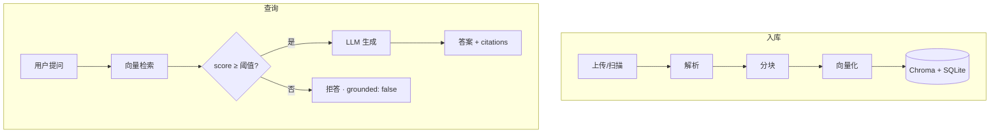

<div align="center">

<h1>exam-rag</h1>
<p><strong>本地 RAG 复习助手 · 信号与系统课程</strong></p>

[](https://www.python.org/)
[](https://fastapi.tiangolo.com/)
[](https://www.trychroma.com/)
[](https://docs.astral.sh/uv/)
[](#)

**上传课程资料 · 语义检索 · 带引用回答 · 低分拒答**

[快速开始](#快速开始) · [架构](#架构) · [配置](#配置) · [API](#api) · [开发](#开发) · [文档](docs/)

</div>

---

## 快速开始

> [!TIP]
> 需要 Python ≥ 3.11、[uv](https://docs.astral.sh/uv/)、[pnpm](https://pnpm.io/)，以及 OpenAI 兼容 API（`LLM_API_KEY`）。扫描版 PDF 可选 [Tesseract](https://github.com/tesseract-ocr/tesseract)（`eng` / `chi_sim`）。

```bash
cp .env.example .env          # 填写 LLM_API_KEY
uv sync && pnpm install && pnpm build
uv run exam                   # → http://127.0.0.1:8787
```

| 地址 | 用途 |
|:-----|:-----|
| [`/`](http://127.0.0.1:8787/) | Web 工作台（资料库 + 问答） |
| [`/settings`](http://127.0.0.1:8787/settings) | 运行配置（只读） |
| [`/docs`](http://127.0.0.1:8787/docs) | OpenAPI 交互文档 |
| [`/api/v1/health`](http://127.0.0.1:8787/api/v1/health) | 健康检查 |

启动时自动：校验配置 → 预热 Embedding → 扫描 `data/knowledge/` 未入库文件。

```bash
curl http://127.0.0.1:8787/api/v1/health
uv run pytest -q              # 单元测试（默认跳过 integration）
```

---

## 架构



> [!NOTE]
> 检索最高分低于 `score_threshold` 时返回 `grounded: false`，固定文案「资料库中未找到相关内容」。

| 模块 | 职责 |
|:-----|:-----|
| `services/ingestion.py` | 解析 → 分块 → 向量化 → 写入 |
| `services/parsing.py` | PDF / DOCX / PPTX / TXT / MD（PDF 可选 OCR；`.doc` 需 LibreOffice） |
| `services/retrieval.py` | 向量相似度 top_k |
| `services/generation.py` | 拼 prompt、调 LLM、组装 citations |
| `services/query.py` | 串联检索与生成，拒答判断 |
| `services/embedding.py` | 本地 sentence-transformers 或 OpenAI 兼容 API |
| `services/llm.py` | OpenAI 兼容对话 API |

<details>
<summary><strong>目录结构</strong></summary>

```
exam-rag/
├── data/knowledge/          # 原始资料
├── storage/                 # Chroma · SQLite · 日志
├── src/
│   ├── main.py              # FastAPI 入口
│   ├── apis/v1/             # health · config · documents · ask
│   └── services/            # 业务逻辑 + storage/
├── workbench/               # React + Vite 前端源码
├── www/                     # pnpm build 输出
└── tests/
```

</details>

README 用 Mermaid 渲染；Excalidraw 风格 SVG：`uv run python scripts/gen_arch_svgs.py`，或编辑 `docs/assets/excalidraw/*.excalidraw`。

---

## 配置

优先级：**环境变量 > `.env` > 代码默认值**。复制 `.env.example` 后按需修改。

| 分组 | 关键变量 |
|:-----|:---------|
| LLM | `LLM_API_KEY`（必填）· `LLM_BASE_URL` · `LLM_MODEL` |
| Embedding | `EMBEDDING_PROVIDER`（`local` / `openai`）· `EMBEDDING_MODEL` |
| 存储 | `CHROMA_PATH` · `SQLITE_PATH` · `KNOWLEDGE_DIR` · `MAX_UPLOAD_MB` |
| PDF | `PDF_USE_OCR` · `PDF_FORCE_OCR` · `PDF_OCR_LANGUAGE` |

<details>
<summary><strong>检索与分块参数</strong>（<code>config.py</code>，无 env 覆盖）</summary>

| 参数 | 默认值 |
|:-----|:-------|
| `top_k` | 20 |
| `score_threshold` | 0.25 |
| `chunk_size` | 800 |
| `chunk_overlap` | 50 |

</details>

---

## API

统一响应：`{ "code": 200, "data": { ... } }` 或 `{ "code": 4xx, "message": "..." }`。

| 方法 | 路径 | 说明 |
|:----:|:-----|:-----|
| `GET` | `/api/v1/health` | Chroma / SQLite / Embedding / LLM 连通性 |
| `GET` | `/api/v1/config` | 非敏感配置快照 |
| `POST` | `/api/v1/documents` | 上传资料并入库 |
| `GET` | `/api/v1/documents` | 列出全部文档 |
| `POST` | `/api/v1/documents/scan` | 扫描 `data/knowledge/` |
| `DELETE` | `/api/v1/documents/{doc_id}` | 删除文档及向量 |
| `POST` | `/api/v1/ask` | 问答 |

<details>
<summary><strong>问答示例</strong></summary>

**请求**

```json
POST /api/v1/ask
{
  "question": "卷积定理是什么？",
  "mode": "qa",
  "stream": false
}
```

**响应**

```json
{
  "code": 200,
  "data": {
    "answer": "...",
    "grounded": true,
    "citations": [
      { "source_file": "chapter3.pdf", "page": 42, "snippet": "...", "score": 0.68 }
    ]
  }
}
```

`stream: true` 时返回 **SSE**（`text/event-stream`），事件顺序：`phase` → `delta` → `done`（拒答时直接 `done`）。

</details>

支持上传：`.pdf` · `.txt` · `.md` · `.doc` · `.docx` · `.pptx`

---

## 开发

```bash
uv run exam                   # 启动（需 pnpm build）
DEBUG=true uv run exam        # 热重载
pnpm dev                      # Vite 热更新，/api 代理到 :8787
pnpm build && pnpm typecheck
uv run pytest -q -m integration   # 需 Embedding + LLM API
```

| 约定 | 说明 |
|:-----|:-----|
| `apis/` | 只做 HTTP，不写 RAG 细节 |
| `services/` | 不 import FastAPI |
| 新依赖 | `uv add <package>` |

> [!IMPORTANT]
> WSL 用户：venv 放在 `~/` 本地路径，勿放 `/mnt/` 挂载盘——IO 慢会导致模型加载超时。

---

## 设计文档

| 文档 | 内容 |
|:-----|:-----|
| [01 产品边界](docs/01-产品边界.md) | 场景、功能清单、Agent 形态 |
| [02 模块架构](docs/02-模块架构.md) | 流水线、数据模型、API 细节 |
| [03 工程规范](docs/03-工程规范.md) | uv、日志、部署约定 |
| [04 后续演进](docs/04-后续演进规范.md) | P1～P3 路线图 |
| [05 Web UI 规划](docs/05-WebUI规划.md) | 工作台规格、React + Vite 方案 |

---

<div align="center">

<sub>

**exam-rag** · 本地 RAG 复习助手 · 资料不上云

</sub>

</div>
