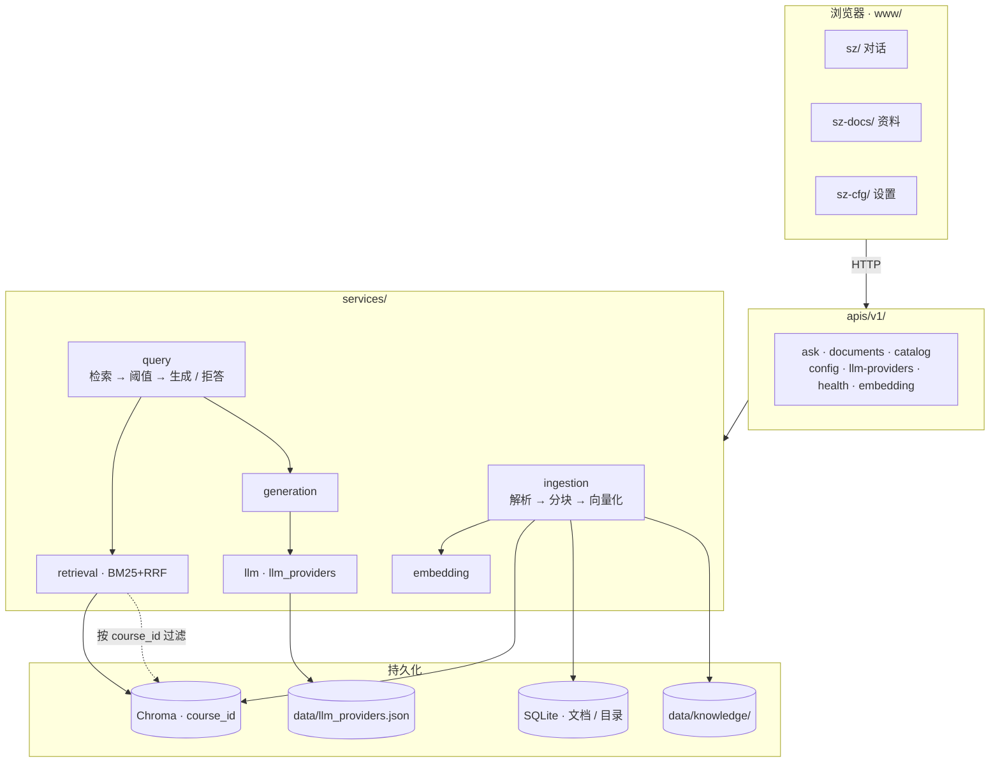
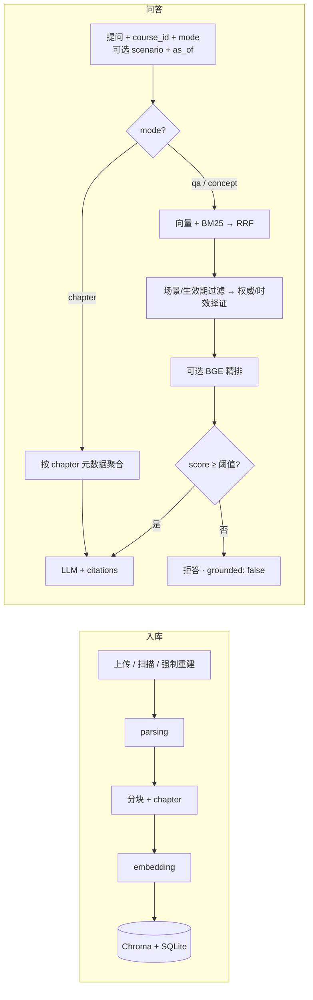

<div align="center">

# 溯知

### exam-rag · 据源而答 · 出处可循

把讲义、笔记、真题放进本机资料库，用自然语言提问。  
答案必须落到具体片段；检索不够就拒答，不硬编。

[](https://www.python.org/)
[](https://fastapi.tiangolo.com/)
[](https://www.trychroma.com/)
[](https://docs.astral.sh/uv/)

</div>

## 它做什么

本地跑起来的课程资料问答：入库 → 按课隔离检索 → 带引用作答。前端在 `www/`（手写 HTML/CSS/JS，无构建），后端是 FastAPI + Chroma + SQLite。

| 能力 | 说明 |
|:-----|:-----|
| 自由问答 | `mode=qa`，混合检索（向量 + BM25 → RRF；可选 BGE 精排） |
| 知识点 | `mode=concept`，更大 top_k，按「定义 → 公式 → 例题」聚合 |
| 章节概览 | `mode=chapter`，按 `chapter` 元数据聚合（不走语义检索） |
| 拒答 | 最高分低于阈值 → `grounded: false`，固定文案，禁止无引用硬编 |
| 多课隔离 | 一切检索 / 上传 / 删除都带 `course_id` |
| 资料格式 | PDF · TXT · MD · DOC · DOCX · PPTX；PDF 支持 MinerU 结构解析与 OCR 回退 |
| PDF 自动更新 | 哈希去重 + 文件名/内容匹配；新版影子入库成功后再切换 |
| 证据治理 | 自动抽取版本/生效期/权威候选；人工固定场景后按场景、时效、权威筛选并解释引用 |
| 意图路由 | 三层漏斗：规则直达 → 会话状态继承 → 受约束 LLM 兜底；不会将全部请求交给模型 |

## Quick Start

需要 Python ≥ 3.11、[uv](https://docs.astral.sh/uv/)，以及 OpenAI 兼容的对话 API（`LLM_API_KEY`）。PDF 默认尝试 MinerU 结构解析；未安装或执行失败时会回退到 PyMuPDF 链路，因此不阻塞基本使用。扫描版 PDF 的回退 OCR 可选 [Tesseract](https://github.com/tesseract-ocr/tesseract)（`eng` / `chi_sim`）；旧版 `.doc` 需 [LibreOffice](https://www.libreoffice.org/) 或本机 Microsoft Word。

```bash
cp .env.example .env   # 填写 LLM_API_KEY，或启动后在设置页注册模型
uv sync
uv run exam            # → http://127.0.0.1:8787
```

| 地址 | 用途 |
|:-----|:-----|
| [`/sz/`](http://127.0.0.1:8787/sz/) | 对话（自由问答 / 知识点 / 章节概览） |
| [`/sz-docs/`](http://127.0.0.1:8787/sz-docs/) | 资料上传 / 扫描（可选强制重建） |
| [`/sz-cfg/`](http://127.0.0.1:8787/sz-cfg/) | 设置（LLM、检索与 BGE 精排、OCR…） |
| [`/docs`](http://127.0.0.1:8787/docs) | OpenAPI |
| [`/api/v1/health`](http://127.0.0.1:8787/api/v1/health) | 健康检查 |

启动时会校验配置；资料入库请在资料页手动上传或扫描（启动不再自动扫库）。

## Commands

| 命令 | 说明 |
|:-----|:-----|
| `uv sync` | 安装依赖 |
| `uv run exam` | 启动服务（默认 `8787`） |
| `DEBUG=true uv run exam` | 调试模式 |
| `uv run pytest -q` | 单元测试 |
| `uv run pytest -q -m integration` | 集成测试（需 Embedding 与 LLM） |
| `uv run python -m tests.eval.run_retrieval_eval --chroma ./storage/chroma` | 离线 Recall@K / MRR |
| `uv add <package>` | 添加依赖 |

```bash
curl http://127.0.0.1:8787/api/v1/health
```

## Architecture

浏览器只调 `/api/v1/*`；RAG 在 `services/`，不进 UI。





| 模块 | 职责 |
|:-----|:-----|
| `ingestion` / `parsing` | 解析分块入库；PDF 支持 MinerU 结构还原、语义切片、可选视觉摘要与 OCR 回退 |
| `retrieval` / `rerank` | 向量 + BM25 → RRF；按场景/生效期过滤，再按权威/时效择证；可选 BGE CrossEncoder 精排 |
| `query` / `intent` / `generation` | 三层意图路由与 `qa` / `concept` / `chapter` 编排、prompt |
| `eval_metrics` | 离线 Recall@K / MRR |
| `embedding` / `llm` | 本地或 OpenAI 兼容 API |
| `storage/` | Chroma 向量 · SQLite 元数据与目录 |

细节见 [docs/02-模块架构.md](docs/02-模块架构.md)。

<details>
<summary>目录结构</summary>

```
exam-rag/
├── data/                    # 运行时（gitignore）：knowledge、llm_providers.json
├── storage/                 # 运行时（gitignore）：Chroma · meta.db · 日志
├── src/
│   ├── main.py              # FastAPI · 挂载 www/
│   ├── apis/v1/
│   └── services/
├── www/                     # 前端源码（入库）
│   ├── shared/
│   ├── sz/
│   ├── sz-docs/
│   └── sz-cfg/
├── docs/
└── tests/
```

</details>

## Configuration

优先级：**环境变量 > `.env` > 代码默认值**。复制 `.env.example`，或在 `/sz-cfg/` 改。

| 分组 | 关键变量 |
|:-----|:---------|
| LLM | `LLM_PROVIDER` · `LLM_API_KEY` · `LLM_BASE_URL` · `LLM_MODEL` |
| Embedding | `EMBEDDING_PROVIDER`（`local` / `openai`）· `EMBEDDING_MODEL` |
| 存储 | `CHROMA_PATH` · `SQLITE_PATH` · `KNOWLEDGE_DIR` · `MAX_UPLOAD_MB` |
| PDF | `PDF_PARSER` · `MINERU_CMD` · `MINERU_TIMEOUT` · `PDF_USE_OCR` · `PDF_FORCE_OCR` · `PDF_OCR_LANGUAGE` |
| 视觉摘要（可选） | `VISUAL_MODEL` · `VISUAL_BASE_URL` · `VISUAL_API_KEY` · `VISUAL_TIMEOUT` |
| 代理 | `PROXY_URL` · `PROXY_ENABLED` · `NO_PROXY` |

可注册多个 LLM（OpenAI 兼容 / Ollama），「设为当前」后会写回 `.env`。

<details>
<summary>检索与分块</summary>

| 参数 | 默认 | 含义 |
|:-----|:-----|:-----|
| `top_k` | 5 | RRF 融合后保留条数；`concept` 默认更大 |
| `score_threshold` | 0.25 | 低于此分拒答；精排开启时作用于 sigmoid(logit) |
| `RERANK_ENABLED` | false | 是否启用 BGE CrossEncoder 精排 |
| `RERANK_MODEL` | `BAAI/bge-reranker-v2-m3` | 精排模型（sentence-transformers） |
| `RERANK_CANDIDATES` | 20 | 精排前候选池大小 |
| `RERANK_TOP_N` | 0（=top_k） | 精排后保留条数 |
| `chunk_size` | 800 | 分块字符数 |
| `chunk_overlap` | 50 | 相邻块重叠 |

</details>

## API

统一：`{ "code": 200, "data": … }` 或 `{ "code": 4xx, "message": "…" }`。完整契约见 [`/docs`](http://127.0.0.1:8787/docs)。

| 方法 | 路径 | 说明 |
|:----:|:-----|:-----|
| `GET` | `/api/v1/health` | 连通性 |
| `GET` / `PATCH` | `/api/v1/config` | 配置 |
| `GET` / `POST` | `/api/v1/llm-providers` | 列出 / 注册模型 |
| `POST` | `/api/v1/llm-providers/active` | 切换当前模型 |
| `DELETE` | `/api/v1/llm-providers/{name}` | 删除注册项 |
| `POST` | `/api/v1/embedding/warmup` | 后台拉取/加载本地模型或探测远程 API |
| `GET` | `/api/v1/embedding/status` | Embedding 就绪状态与拉取进度（`warmup.percent`） |
| `GET` | `/api/v1/colleges` | 学院 |
| `GET` | `/api/v1/courses` | 课程（可选 `?college_id=`） |
| `POST` | `/api/v1/documents` | 上传（Form 必填 `course_id`） |
| `GET` | `/api/v1/documents` | 列表（`?course_id=`） |
| `GET` | `/api/v1/documents/summary` | 资料分类概览（`?course_id=&by=type\|chapter`，默认 `type`） |
| `POST` | `/api/v1/documents/scan` | 扫描 knowledge（Form：`course_id`；PDF 自动识别更新；`force=true` 强制重新解析） |
| `PATCH` | `/api/v1/documents/{doc_id}/evidence` | 人工修订版本、生效期、权威及固定场景（`?course_id=`） |
| `DELETE` | `/api/v1/documents/{doc_id}` | 删除（`?course_id=`） |
| `POST` | `/api/v1/ask` | 问答（`course_id`；`mode=auto\|qa\|concept\|chapter`，默认 `auto`；可选 `scenario`、`as_of`） |
| `POST` | `/api/v1/agent/run` | Agent 多步问答（`course_id`；可选 `scenario` / `as_of`；`agentic=true` 启用工具调用；`max_steps` 上限 10） |
| `POST` | `/api/v1/question-bank/generate` | 基于当前课程有效资料生成并保存题目草稿 |
| `GET/POST/PATCH/DELETE` | `/api/v1/question-bank/questions` | 我的题库题目管理（全程 `course_id` 隔离） |
| `GET/POST/DELETE` | `/api/v1/question-bank/papers` | 试卷保存、读取与删除（全程 `course_id` 隔离） |
| `POST` | `/api/v1/question-bank/papers/assemble` | 按题型、难度、章节、题数和分值蓝图受控自动组卷 |

默认课：`course-default`。同一物理文件不会跨课改归属。

**章节概览（`mode=chapter`）**：依赖入库时写入的 `chapter` 元数据。旧库请到资料页勾选「强制重建」再扫描，或重新上传；普通扫描仅在文件 mtime 变更时重入库。

**BGE 精排**：设置页打开「启用 BGE 精排」后，对混合召回结果做 CrossEncoder 重排；默认关闭（避免首启强制下载模型）。

**BGE 模型下载失败 / `rerank=false`**：精排开启后首次使用需要下载 `RERANK_MODEL`（默认 `BAAI/bge-reranker-v2-m3`）。若日志提示无法连接 `HF_ENDPOINT` 且本地缓存不存在，系统会跳过精排以保证问答可用，检索日志显示 `rerank=false`。可临时设置 `RERANK_ENABLED=false` 后重启；或确认镜像/代理可访问，再设置 `HF_ENDPOINT=https://huggingface.co`（或可用镜像）重新启动并等待下载完成。生产或离线环境建议预先下载完整模型，并把 `RERANK_MODEL` 指向本地目录。

**PDF 自动更新**：上传 PDF 或扫描资料目录时，系统先计算 SHA-256 去重；再以规范化文件名和已入库文本相似度匹配同一课程的旧版。新版以不可检索状态完成解析/向量化后才切换；失败时旧版继续可用。文件名相似但内容差异过大的 PDF 会作为新资料入库。

**证据元数据与择证**：入库会从正文抽取版本号、生效/失效日期及权威层级候选，记录抽取置信度。自然语言「适用范围」不会直接用于过滤，须通过 `PATCH /documents/{doc_id}/evidence?course_id=...` 设为稳定的场景键（如 `考试`、`实验`）。问答传入 `scenario` 和 `as_of`（`YYYY-MM-DD`）后，仅保留该场景或 `all`、且当日有效的证据；其后优先更高权威，再优先较新的生效版本。每条 citation 返回版本、时效、权威、场景和选择原因。

**意图识别**：`mode` 未指定时为 `auto`。规则层毫秒级识别章节、概念、版本/时效和受控场景；指代性追问（如“按刚才那个范围”）从会话中继承上一轮已保存的结构化意图；仅在无可继承状态的模糊指代下调用 LLM，并强制其只返回经过枚举和日期校验的 JSON 计划。实际检索、范围过滤和证据选择始终由后端确定性执行。响应 `data.intent` 可用于观测路由层、置信度与最终检索范围。

**Agent 多步问答（`/agent/run`）**：默认走 P2-B 固定图 `retrieve → grade → rewrite/generate → refuse`，检索不达标时自动改写查询重试（`max_steps` 默认 3、上限 10）。可传 `scenario`、`as_of` 复用证据范围/时效过滤。`langgraph` 已纳入项目依赖，`uv sync` 即会安装。

**P2-C（受控工具调用）**：传 `agentic: true` 后，模型通过 OpenAI function calling 在 `agent → tool → agent` 中选择 `search_pdf` / `read_page` / `extract_table` / `analyze_chart` / `quote_source` 五个只读工具。系统强制课程范围、参数白名单与工具轮数；没有工具证据时一律拒答。响应 `data.tool_calls` 仅返回脱敏的工具名、参数、成功状态和引用数量。模型调用异常或未配置时自动回退 P2-B 固定图（`agentic: false`）。详见 `docs/04-后续演进规范.md` §4.4.8。

**我的题库**：访问 `/sz-bank/`，选择课程后按知识点、章节、题型、难度和题数出题。系统先按 `course_id`、`scenario`、`as_of` 检索有效资料；无证据时返回 `grounded: false` 且不会保存。成功生成的题目默认是 `draft` 草稿，并保存答案、解析、题型、难度、章节、证据引用与资料版本；勾选题目即可保存试卷。还可按蓝图自动组卷：优先复用带有效证据的同课程题目，缺题才补生成草稿，并在题数、题型、难度、章节、总分、去重和课程隔离校验全部通过后保存。题库和试卷均严格课程隔离。

<details>
<summary>问答示例</summary>

```json
POST /api/v1/ask
{
  "question": "卷积定理是什么？",
  "course_id": "course-default",
  "mode": "qa",
  "stream": false
}
```

带固定场景与“截至日期”的问答：

```json
{
  "question": "本次考试可以携带计算器吗？",
  "course_id": "course-default",
  "scenario": "考试",
  "as_of": "2026-09-01"
}
```

知识点（定义 → 公式 → 例题）：

```json
POST /api/v1/ask
{
  "question": "卷积定理",
  "course_id": "course-default",
  "mode": "concept",
  "stream": true
}
```

章节概览（知识清单 → 重点 → 推荐自测；不走语义检索）：

```json
POST /api/v1/ask
{
  "question": "第3章 傅里叶变换",
  "course_id": "course-default",
  "mode": "chapter",
  "stream": false
}
```

```json
{
  "code": 200,
  "data": {
    "answer": "...",
    "grounded": true,
    "citations": [
      { "source_file": "chapter3.pdf", "page": 42, "snippet": "...", "score": 0.68 }
    ]
  }
}
```

`stream: true` → SSE：`phase` → `delta` → `done`（拒答则直接 `done`）。

</details>

## Status

| 阶段 | 状态 |
|:-----|:-----|
| P0 入库 / 问答 / 拒答 / WebUI | 已实现 |
| P1-A 学院·课程隔离 | 已实现 |
| P1-B `mode=concept` · 混合检索 · PPT | 已实现 |
| P2-A 离线评估 · BGE 精排 · `mode=chapter` | 已实现（精排默认关） |
| PDF 结构化解析 · 语义切片 · 可选视觉摘要 | 已实现（MinerU 不可用时自动回退） |
| PDF 内容指纹 · 影子入库 · 自动版本切换 | 已实现 |
| 证据治理 · 三层意图路由 | 已实现 |
| P2-B Agent（LangGraph 多步循环） | 已实现 |
| P2-C LLM 自主决策 · 工具调用（function calling） | 已实现（显式开关，P2-B 默认/降级） |
| 我的题库 · 受控出题 · 组卷 | 已实现（题目草稿、证据引用、SQLite 保存、WebUI） |
| P3 平台化 | 未做 |

## Development

| 约定 | 说明 |
|:-----|:-----|
| `apis/` | 只做 HTTP |
| `services/` | 不 import FastAPI |
| `www/` | 前端源码，随仓库提交 |
| 新依赖 | `uv add <package>` |

WSL：venv 放 `~/`，别放 `/mnt/`，否则模型加载容易超时。

## Documentation

| 文档 | 内容 |
|:-----|:-----|
| [01 产品边界](docs/01-产品边界.md) | 场景与范围 |
| [02 模块架构](docs/02-模块架构.md) | 流水线与数据模型 |
| [03 工程规范](docs/03-工程规范.md) | 工具链与约定 |
| [04 后续演进](docs/04-后续演进规范.md) | 多课程、检索增强、Agent |
| [05 Web UI](docs/05-WebUI规划.md) | 工作台规格 |
