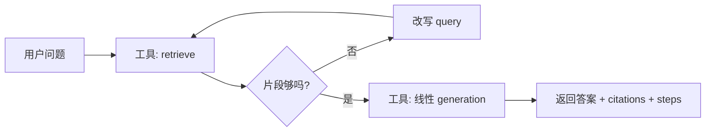

# 04 后续演进规范

> RAG 复习助手 · P1 及以后的功能、架构扩展与迁移约定  
> 2026年8月 · 与当前仓库进度对齐
> **当前基线**：P0–P2-C 已落地；P2-C 由显式开关启用，P2-B 保持默认与降级路径

---

## 4.0 文档定位

| 文档 | 阶段 | 职责 |
|------|------|------|
| 01 产品边界 | P0 已定 + 简述 P1/P2 | 做什么、不做什么 |
| 02 模块架构 | P0 实现规格 | 目录、API、单课数据模型 |
| 03 工程规范 | P0 实现规格 | uv、FastAPI、部署 |
| **04 后续演进（本文）** | **P1～P3 状态与规划** | 记录已落地项、未完成边界与后续迁移约定 |

**原则**：
- P0 的 `services/` 主链路（ingestion → retrieval → generation）**不因 Agent 或多学科而重写**，只做扩展。
- Agent（LangGraph）**包在 RAG 外**，调用现有 `retrieve` / `ask`，不替代 `query.py` 的线性编排。
- 多学科隔离靠 **`course_id` 元数据 + 检索 filter**，不靠多个独立部署。
- 资料证据治理：版本、时效、权威为可比较元数据；适用范围采用人工确认的受控场景键，检索先过滤再择证。

---

## 4.1 演进阶段总览

| 阶段 | 主题 | 交付物 | 依赖 |
|------|------|--------|------|
| **P0** | 单课 RAG MVP | `/health`、`/documents`、`/ask`、拒答、引用 | — |
| **P0.5** | 检索可测 | `golden_qa.jsonl`、只测 `retrieval` 的 pytest | P0 |
| **P1-A** | 多学科隔离 | `colleges` / `courses`、API 带 `course_id`、检索 filter | P0 |
| **P1-B** | 检索增强 | BM25 + RRF、`mode=concept`、PPT 解析 | P0 |
| **P2-A** | 质量与模式 | Reranker、`mode=chapter`、离线 Recall@K / MRR | P1 |
| **P2-B** | Agent 循环 | LangGraph、`POST /agent/run`（或 `ask` 增 `use_agent`） | P1、RAG 稳定 |
| **P2-C** | 决策型 Agent | 受控 function-calling 决策环、工具调用观测、P2-B 默认/降级 | P2-B、模型支持 tools |
| **P3** | 平台化 | 用户登录、课程 ACL、PostgreSQL + pgvector、异步入库 | P2、有明确需求再做 |

**当前进度**：P0 → P0.5 → P1-A → P1-B → P2-A → P2-B → P2-C 已完成；P2-C 仅在显式 `agentic=true` 时启用，P3 按需启动。

**题库扩展**：已增加“我的题库”作为 P2-C 的受控生成能力：`POST /question-bank/generate` 先检索当前课程的有效资料，再生成并保存题目草稿；题目保存证据引用、资料版本、题型、难度与章节。题目可手动维护，多个同课程题目可保存为试卷。`POST /question-bank/papers/assemble` 接收题型、难度、章节、题数与分值蓝图，优先复用带有效证据的题目，缺题才补生成，并在去重、课程、题数与总分校验通过后保存。此能力不授予 Agent 写入资料库的权限，写入范围仅限题库 SQLite 表。

---

## 4.2 多学院 · 多学科隔离（P1-A）

### 4.2.1 目标

- 不同课程（如「默认课程」与「思政原理」）**互不串库、互不串答**。
- 用户在前端 **先选学院（可选）→ 再选课程**，再问问题。
- 不要求 P1-A 做登录；内网共用、靠 **`course_id` 显式选择** 隔离。

### 4.2.2 组织模型

```
college（学院）
  └── course（课程 / 学科）     ← 检索隔离边界
        └── document → chunks
```

| 实体 | 说明 | 示例（产品默认种子） |
|------|------|------|
| `college_id` | 学院标识 | `college-default` |
| `college` | 展示名 | 默认学院 |
| `course_id` | 课程标识（**检索 filter 主键**） | `course-default` |
| `course` | 展示名 | 默认课程 |

> 历史种子 `college-telecom` / `course-signals-2025` 启动时迁到默认课。跨课负例可用 `course-ideology-2025` 等非默认 ID。

### 4.2.3 数据模型变更（相对 02 §2.6）

**SQLite 新增表**：

```sql
-- 学院
colleges(id TEXT PRIMARY KEY, name TEXT NOT NULL, created_at TEXT)

-- 课程（学科）
courses(id TEXT PRIMARY KEY, college_id TEXT NOT NULL, name TEXT NOT NULL, created_at TEXT,
        FOREIGN KEY(college_id) REFERENCES colleges(id))

-- documents 表变更：course 字符串 → course_id 外键
documents(..., course_id TEXT NOT NULL, ...)
```

**Chunk metadata（Chroma）**：

```python
{
    "doc_id": str,
    "college_id": str,
    "course_id": str,          # ★ 检索必 filter
    "course": str,             # 展示
    "source_file": str,
    "page": int | None,
    "chunk_index": int,
    "chapter": str | None,
    "doc_type": str | None,
}
```

**规则**：
- 入库时必须写入 `college_id`、`course_id`。
- 检索时 **必须** `filters={"course_id": course_id}`，禁止无 filter 全库搜索。
- 删文档：同步删向量 + 更新 `doc_store`（同 P0）。

**向量库策略（P1-A）**：单 Chroma collection + metadata filter（课程数 < 约 50 时足够）。课程量极大再评估「每课一 collection」。

### 4.2.4 API 变更

| 方法 | 路径 | 阶段 | 说明 |
|------|------|------|------|
| GET | `/colleges` | P1-A | 学院列表 |
| GET | `/courses` | P1-A | 查询参数 `college_id`（可选） |
| POST | `/documents` | P1-A 改 | **必填** `course_id`（multipart 字段） |
| POST | `/ask` | P1-A 改 | **必填** `course_id`；保留 `mode` |
| GET | `/documents` | P1-A 可选 | `?course_id=` 资料列表 |

**POST /ask 请求示例**：

```json
{
  "question": "思政课的考试题型有哪些",
  "course_id": "course-ideology-2025",
  "mode": "qa"
}
```

**校验**：
- `course_id` 不存在 → 404
- 检索结果为空或分数低于阈值 → `grounded: false`（同 P0 拒答）

### 4.2.5 services 变更

```python
# 签名扩展（P1-A）
ingestion.ingest_file(path, course_id: str) -> doc_id
retrieval.retrieve(question, course_id: str, top_k: int = 5) -> list[ScoredChunk]
query.ask(question, course_id: str, mode: str = "qa") -> Answer
```

新增 `storage/catalog_store.py`：学院/课程 CRUD，供 apis 与校验使用。

### 4.2.6 前端

手写静态 UI 已挂载：`www/sz` · `www/sz-docs` · `www/sz-cfg`。契约：选课后 ask / upload / scan / list / delete 均须带当前 `course_id`；顶栏展示当前课程名。规格见 [05-WebUI规划.md](./05-WebUI规划.md)。
### 4.2.7 测试

`golden_qa.jsonl` 每行增加 `course_id`：

```json
{
  "course_id": "course-default",
  "question": "傅里叶变换时移性质",
  "expected_contains": ["时移"]
}
```

**负例**：用 A 课问题 + B 课 `course_id`（如 `course-ideology-2025`），不得命中 A 课 chunk。

---

## 4.3 检索与查询模式增强（P1-B / P2-A）

### 4.3.1 P1-B：混合检索 + 知识点 + PPT

| 项 | 实现位置 | 说明 |
|----|----------|------|
| BM25 | `services/retrieval.py` 或 `services/retrieval_bm25.py` | 按 `course_id` 隔离索引 |
| RRF 融合 | `retrieval.py` | 向量 top_k + BM25 top_k → 融合 |
| `mode=concept` | `query.py` + `generation.py` | 更大 top_k + 聚合 prompt |
| PPT | `ingestion.py` | python-pptx，按 slide 分块 |

`query.ask` 签名不变（已含 `course_id`、`mode`）。

### 4.3.2 P2-A：精排与章节概览

| 项 | 实现 | 说明 |
|----|------|------|
| BGE-Reranker | `retrieval.rerank()` 或 postprocess 步骤 | 对融合结果精排 top 3～5 |
| `mode=chapter` | `query.py` | **不走语义检索**；`doc_store` + metadata 按 `chapter` 聚合 chunk → LLM 概览 |
| 离线评估 | `tests/eval/` 或脚本 | Recall@5、MRR；按 `course_id` 分集统计 |
| LLM 切换 | `config.py` + `llm.py` | 多 provider 配置，不改业务层 |

### 4.3.3 可选：会话内短期上下文（P1 末 / P2）

- **不是**跨会话长期记忆。
- `POST /ask` 可选字段 `history: [{role, content}, ...]`（最近 3～5 轮）。
- 仅辅助指代（「刚才那个公式」）；**答案仍以 RAG citations 为准**。
- 不写入向量库。

---

## 4.4 Agent 循环（P2-B · LangGraph）

### 4.4.1 引入条件（已满足）

引入 Agent 所需的以下条件已满足：

1. P0 + P1-A 稳定，多学科不串答。
2. 线性 `query.ask` 已满足大部分问答。
3. 有明确 **多步任务** 需求，例如：
   - 检索不够 → 换关键词再检 → 再答
   - 根据本章资料 **自动生成 5 道选择题**
   - 对比两份重点文档差异

若只需「问一句答一句 + 引用」，**不要上 Agent**。

### 4.4.2 架构原则

```
                    ┌─────────────────────────┐
  POST /agent/run   │  services/agent/        │
  或 ask+use_agent  │  LangGraph 状态图        │
                    └───────────┬─────────────┘
                                │ 调用工具（不重写 RAG）
                    ┌───────────▼─────────────┐
                    │  retrieve(course_id)    │  ← services/retrieval.py
                    │  ask(course_id, mode)   │  ← services/query.py（可选）
                    │  list_documents(...)    │  ← doc_store
                    └─────────────────────────┘
```

- **LangGraph 只做编排**；检索、生成、入库逻辑仍在 `services/`。
- **不**用 Agent 替代 `retrieval.py` / `generation.py`。
- **不**引入 MCP、Skills 框架；工具函数直接调 Python service。

### 4.4.3 目录扩展

```
src/services/
├── agent/
│   ├── graph.py           # LangGraph 图定义
│   ├── state.py           # AgentState（question, course_id, steps, citations...）
│   ├── tools.py           # 包装 retrieve / ask / list_docs
│   └── nodes.py           # 节点：retrieve, grade, rewrite_query, generate, finish
├── query.py               # 保留；线性问答默认路径
└── ...
```

```
src/apis/v1/
├── ask.py                 # 默认线性 RAG
└── agent.py               # POST /api/v1/agent/run（P2-B）
```

### 4.4.4 典型 Agent 循环（复习场景）



**Grade（是否够）**：可规则（top score < 阈值）或小模型判断；**不够则改写 query 再检，最多 N 轮（如 2～3）**，防止死循环。

**状态字段示例**：

```python
class AgentState(TypedDict):
    question: str
    course_id: str
    mode: str
    queries: list[str]          # 含改写历史
    chunks: list[ScoredChunk]
    citations: list[Citation]
    answer: str
    grounded: bool
    steps: list[str]            # 可观测：检索了几次、改了什么 query
```

### 4.4.5 API

**方案 A（推荐）**：独立端点，线性 `/ask` 不变。

```
POST /agent/run
{
  "question": "根据第3章资料出5道选择题",
  "course_id": "course-signals-2025",
  "max_steps": 5
}
```

响应在 P0 `answer + citations + grounded` 基础上增加：

```json
{
  "code": 200,
  "data": {
    "answer": "...",
    "citations": [...],
    "grounded": true,
    "steps": ["retrieve: 初始问句", "grade: 不足", "retrieve: 改写后...", "generate: 出题"],
    "agent_used": true
  }
}
```

**方案 B**：`POST /ask` 增加 `"use_agent": true`（简单但易与线性路径混淆；优先方案 A）。

### 4.4.6 依赖与工程

- 依赖：`langgraph` 已写入 `pyproject.toml` 与 `uv.lock`，`uv sync` 即会安装。
- Agent 路由同样 **必填 `course_id`**，工具层强制 filter。
- 日志：每个 node 打 INFO（question、course_id、检索次数）；`steps` 返回给前端可选展示「思考过程」。
- 测试：mock LLM + 固定 retrieve 结果，测循环次数上限与拒答。

### 4.4.7 明确不做

| 项 | 原因 |
|----|------|
| MCP | 无多外部工具生态需求 |
| Skills 插件市场 | 用 `query` mode + Agent tools 足够 |
| Agent 写向量库 | 资料只经 `ingestion` 入库 |
| 无 course_id 的 Agent 全库漫游 | 必串答 |

### 4.4.8 决策 + 执行型 Agent（P2-C · 已实现）

> 让模型自己决定「下一步做什么」，而非固定状态图 + 规则分支。仅在调用方显式传入 `agentic=true` 时启用；默认仍使用 P2-B 固定图。

**目标**：把 P2-B 的固定循环（retrieve → grade → rewrite/generate）升级为 **LLM 自主决策 + 工具调用（function calling）**。模型根据上下文与可用工具清单，自己选择调用哪个工具、调用几次，直到给出最终答案。

**当前落地边界**：

1. P2-B 固定循环仍是 `/agent/run` 的默认路径；P2-C 失败或 LLM 未配置时自动回退。
2. `agent/tools.py` 已提供五个只读工具、OpenAI function schema、白名单分发与 `course_id` 强制注入。
3. 工具层单测已覆盖 schema 完整性、未知工具拒绝和分发。
4. `llm.py` 的 `chat_with_tools` 将模型输出归一为 `content` / `tool_calls`；Agent state/graph 实现 `messages → tool_calls → tool result` 条件循环。
5. `AgentRunRequest.agentic` 默认 `false`，为 `true` 时走 P2-C；响应返回脱敏工具调用观测，不泄漏模型原始载荷。

**架构红线**（延续 §4.4.2、§4.4.7）：

- LangGraph 只做编排；检索、生成、入库仍在 `services/`，**不重写 P0 主链路**。
- 工具是 Python service 薄封装，**不引入 MCP / Skills**。
- 每个工具强制 `course_id` filter，禁止无 course_id 全库漫游。
- 工具不写向量库、不读写文件系统 / 外部网络；资料只经 `ingestion` 入库。
- 拒答底线：`grounded: false` 时不得编造。

**决策环**（ReAct 式）：

```
用户问题
  ↓
LLM 决策节点（输入 messages + 工具清单，输出 tool_calls 或最终回答）
  ├─ 有 tool_calls → 工具执行节点 → 结果回填 messages → 回到决策
  └─ 无 tool_calls → 生成最终回答 / 拒答 → finish
```

**文件进度**：

| 文件 | 状态 | 说明 |
|------|------|------|
| `src/services/agent/tools.py` | 已完成 | 五个只读工具、`TOOL_SCHEMAS`、`execute_tool` 白名单分发 |
| `tests/test_agent_tools.py` | 已完成 | 工具行为、schema、未知工具与调度测试 |
| `pyproject.toml` / `uv.lock` | 已完成 | `langgraph` 已纳入依赖 |
| `src/services/llm.py` | 已完成 | `chat_with_tools(messages, tools)` 透传 tools / tool_choice，并归一化 `tool_calls` |
| `src/services/agent/state.py` | 已完成 | `messages`、待执行调用、调用观测和工具轮数 |
| `src/services/agent/nodes.py` | 已完成 | `agentic_agent_node` 与 `agentic_tool_node`，含参数白名单和无证据拒答 |
| `src/services/agent/graph.py` | 已完成 | 保留 P2-B 固定图，P2-C 新增 `agent ↔ tool` 条件循环及上限 |
| `src/models.py` / `apis/v1/agent.py` | 已完成 | `agentic` / `scenario` / `as_of` 请求字段与 `tool_calls` 观测响应 |

**已落地工具清单**：

| 工具 | 用途 | 复用 |
|------|------|------|
| `search_pdf` | 混合检索相关片段并返回引用 | `retrieval.retrieve` |
| `read_page` | 按文档与页码读取已入库切片 | `vector_store.get_chunks` |
| `extract_table` | 按语义或文档/页码提取表格切片 | `vector_store.search/get_chunks` |
| `analyze_chart` | 基于入库时的视觉摘要分析图表 | `image_summary` 切片 + 可选 LLM |
| `quote_source` | 返回文件、页码、章节和切片路径 | `retrieval.retrieve` |

**API**：沿用 `POST /agent/run`，`agentic: bool = false` 继续走 P2-B；`true` 走 P2-C。响应 `data` 提供经过脱敏的 `tool_calls`，并以 `agentic` 标明实际使用的路径；模型调用异常或未配置时该值为 `false`。

**循环上限**：复用 `max_steps`（默认 3、上限 10）作为最大工具调用轮数，防死循环。

**测试进度**：

- [x] 工具 schema 与白名单一致。
- [x] 未知工具名拒绝，已知工具正确分发。
- [x] 工具层由系统注入 `course_id`，不向模型暴露跨课参数。
- [x] mock LLM 返回固定 `tool_calls`，验证决策环路由与 `max_steps` 限制。
- [x] 验证 P2-C 决策环在 `grounded: false` 时不编造。

**风险**：

| 风险 | 缓解 |
|------|------|
| LLM 不支持 function calling | 启动前实测；不支持则降级回 P2-B 固定循环 |
| 成本 / 延迟上升 | `max_steps` 上限 + 控制工具粒度 |
| 自主决策失控（死循环 / 越界） | 工具白名单 + `course_id` 强制 + 循环上限 |
| 拒答底线被破坏 | 生成前强制校验 `grounded` |

**明确不做**：MCP、Skills 插件市场、Agent 写向量库、工具直接读写文件 / 网络、无 `course_id` 全库漫游。

---

## 4.5 权限与平台化（P3 · 按需）

仅在需要「不同学院只能看本院课程」时启动。

| 项 | 做法 |
|----|------|
| 认证 | JWT / Session；扩展 `dependencies.get_current_user()` |
| 授权 | 用户 ↔ 可访问 `course_id` 列表；检索/入库前校验 |
| 存储 | SQLite → **PostgreSQL**；向量 → **pgvector** 或保留 Chroma + PG 元数据 |
| 异步入库 | Celery + Redis；大文件入库走 `tasks/ingest_document` |
| 资料版本 | PDF 已支持内容指纹、影子入库与新旧版切换；P3 再按需添加多人协作、审批和保留策略 |

换库仅替换 `services/storage/` 实现；`ingestion` / `retrieval` / `query` 接口保持不变（见 02 §2.8）。

---

## 4.6 迁移检查清单（P0 → P1-A）

从单课 MVP 升级到多学科时，按序验收：

- [x] SQLite：`colleges`、`courses` 表 + 种子数据（`catalog_store`）
- [x] 现有文档补 `course_id`（列迁移 + 旧种子 ID 归并；无 metadata 的旧向量需重扫）
- [x] Chunk metadata 含 `college_id`、`course_id`
- [x] `ingest_file`、`retrieve`、`ask` 均强制 `course_id`
- [x] `POST /documents`、`POST /ask`、`POST /documents/scan` 缺 `course_id` → 422
- [x] 负例测试：跨 course 检索不命中（`test_retrieval` + golden）
- [x] 前端选课 UI + 请求带 `course_id`（`www/sz` · `sz-docs` · `sz-cfg`）
- [x] `golden_qa.jsonl` 含 `course_id`

---

## 4.6.1 迁移检查清单（P1-B）

- [x] BM25 按 `course_id` 隔离（`vector_store.get_by_course_id` + `_bm25_search`）
- [x] 向量 + BM25 → RRF 融合（`retrieval.retrieve`；`ask` 签名不变）
- [x] `mode=concept`：更大 `top_k` + 聚合 prompt（定义→公式→例题）
- [x] PPT 解析（`parsing._parse_pptx`，P1-A 已落地）
- [x] 单测：`test_retrieval` · `test_ask`（concept）；golden 含 concept + 跨课负例
- [x] 跨课负例：qa / concept 在他课 `course_id` 下仍拒答

---

## 4.6.2 迁移检查清单（P2-A）

- [x] 离线评估：`eval_metrics.recall_at_k` / `mrr`；`tests/fixtures/retrieval_eval.jsonl`；`tests/eval/run_retrieval_eval.py`
- [x] BGE 精排：`rerank.py`（sentence-transformers CrossEncoder）；`RERANK_*` 配置；默认关闭
- [x] `retrieve`：精排开时宽池（`rerank_candidates`）→ RRF → rerank → sigmoid 阈值
- [x] 入库写入 `chapter` 元数据（MD/章标题启发式；弱结构用「第N页」）
- [x] `mode=chapter`：`get_by_chapter` 聚合，不走语义检索；章节概览 prompt
- [x] 评估脚本 `tests/eval/run_retrieval_eval.py`；对话/章节链路 `test_ask`；前端 `qa|concept|chapter`
- [x] 旧库无 chapter：资料页勾选「强制重建」再扫描，或重新上传；普通扫描仅在 mtime 变更时重入库
- [x] `GET /documents/summary?by=type|chapter`：用户可选按文件类型或按内容章节大致分类（章节依赖 `chapter` 元数据）

---

## 4.6.3 迁移检查清单（PDF 结构化解析）

- [x] PDF 类型判断抽样增强（`parsing._pdf_kind`：text / scanned / mixed，不再只看首字符数）
- [x] 解析器默认 `PDF_PARSER=mineru`（MinerU 结构解析；未装/失败回退 pymupdf4llm + OCR）
- [x] 结构还原：`ParsedBlock`（title 层级 / table HTML / formula / image 路径 / caption 关联 / header·footer 保留）
- [x] 语义切片：标题层级 → `section_path`；标题段落合并成组；表格独立成组（列头进 metadata）；图片独立成组
- [x] 丰富 metadata：`block_type` / `section_path` / `table_headers` / `context` 随 chunk 写入 Chroma
- [x] 多模态视觉摘要（可选）：`VISUAL_MODEL` 等配置，对图片/图表生成检索摘要；未配置时回退图片说明或跳过
- [x] 页眉页脚保留在结构里但不进检索正文（避免污染切片）
- [x] 单测：`test_parsing.TestMineruStructure`（结构还原）· `test_ingest.TestChunkStructured`（语义切片）

---

## 4.7 迁移检查清单（P1 → P2-B Agent）

- [x] 线性 `/ask` 回归仍通过
- [x] Agent 工具仅调用 services，不 duplicate RAG
- [x] `max_steps` / 最大 retrieve 轮数有硬上限
- [x] 每步 `course_id` 不变
- [x] `grounded: false` 时 Agent 不得编造
- [x] `steps` 可日志追溯

---

## 4.7.1 迁移检查清单（P2-B → P2-C）

- [x] 只读工具：`search_pdf` / `read_page` / `extract_table` / `analyze_chart` / `quote_source`
- [x] OpenAI function schema 与工具白名单分发
- [x] 工具层由系统强制注入 `course_id`
- [x] 工具注册、行为与未知工具拒绝单测
- [x] `llm.chat_with_tools` 与 `tool_calls` 解析
- [x] `messages → agent_node → tool_node → agent_node` 条件循环
- [x] `/agent/run` 的 `agentic` 开关与工具调用观测响应
- [x] P2-C 循环上限、降级、拒答回归；跨课由系统强制 `course_id` 注入

---

## 4.8 与 01～03 的衔接

| 原约定 | 演进后 |
|--------|--------|
| 01「不做 Agent（P0）」 | P2-B 允许 Agent，见本文 §4.4 |
| 01 产品名「信号与系统」 | 产品扩展为多课程；P0 仍可用单课 seed |
| 02 `course` 字符串 | P1-A 改为 `course_id` + 目录表 |
| 02 API 3 端点 | P1-A 增 `/colleges`、`/courses`；P2-B 增 `/agent/run` |
| 03 LangGraph P2 可选 | P2-B 已纳入依赖并落地，实现细节见本文 §4.4 |

**文档状态**：01 产品边界与 02 当前架构已回写 P1–P2-C 进度；P2-C 已接入且保留 P2-B 默认/降级。

---

## 4.9 演进路线图（一图）

```
P0     单课 RAG ──────────────────────────────────────────────┐
P0.5   golden 检索测试                                         │
P1-A   学院/课程 + course_id 隔离 ◄── 多学科必做               │
P1-B   BM25 / concept / PPT                                    │
P2-A   Reranker / chapter / 离线评估                           │
P2-B   LangGraph Agent 循环 ◄── 多步任务可选                   │
P2-C   LLM 决策 + 工具调用 ◄── 显式开关启用，P2-B 默认/降级 │
P3     登录 ACL / PG / 异步入库 ◄── 平台化按需                 │
                                                               │
         02/03 主架构不变 ──────────────────────────────────────┘
```

---

## 4.10 实施建议

1. P2-C 保留 P2-B 作为默认和降级路径，不直接替换现有 `/agent/run`。
2. 更换 LLM 提供商时，先实测其是否稳定返回 `tool_calls`，再在生产请求中启用 `agentic`。
3. 每完成一阶段，跑单测、跨课负例与对应 `course_id` 的 golden 集。
4. 若本文与代码冲突，以已验证代码为准，并在同一变更中回写 README、02 当前架构和本文迁移清单。
